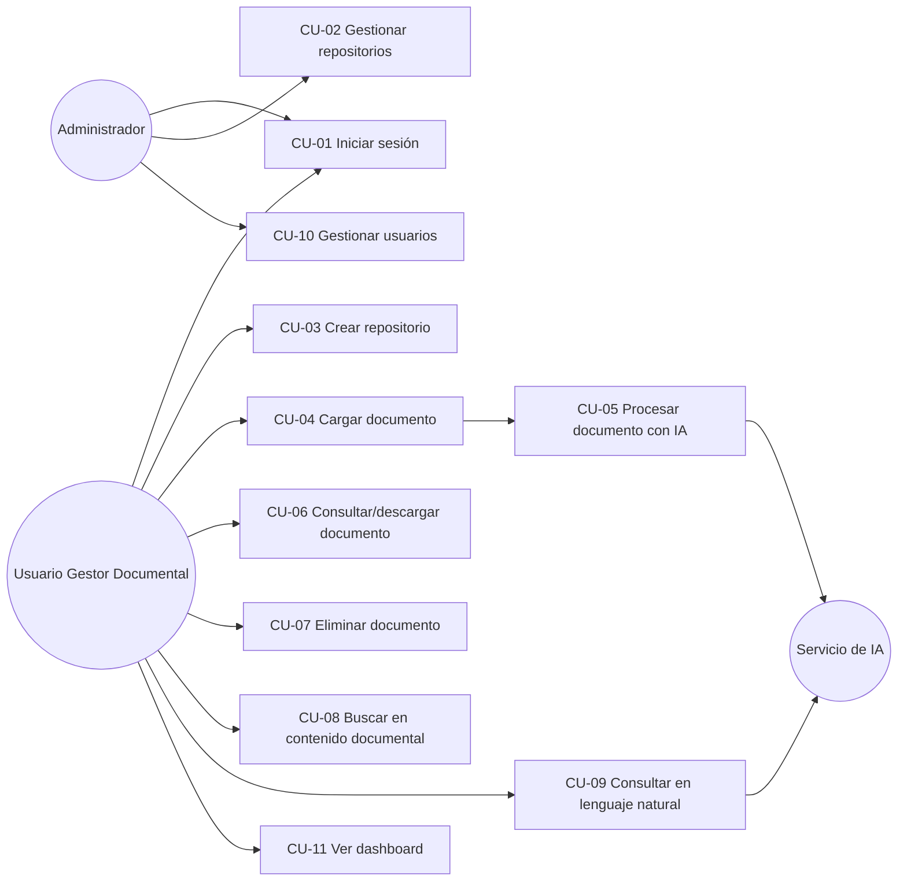

# ANÁLISIS 04 — Casos de Uso y Especificaciones
## Sistema Inteligente de Gestión y Análisis Documental (SIGAD)

*Los casos de uso agrupan una o más historias de usuario en un flujo completo de interacción. Se referencian por CU-XX y se retoman en el Diagrama de Casos de Uso (Diseño 02).*

---

## 1. Diagrama de casos de uso (representación textual/Mermaid)

## 2. Especificaciones de casos de uso

### CU-01 — Iniciar sesión
- **Actor principal:** Administrador, Usuario Gestor Documental
- **Precondiciones:** el usuario tiene una cuenta creada en el sistema.
- **Flujo básico:**
  1. El usuario ingresa usuario y contraseña.
  2. El sistema valida las credenciales.
  3. El sistema genera un token de sesión (JWT) y redirige al dashboard.
- **Flujos alternativos:** credenciales inválidas → el sistema muestra error genérico (paso 2).
- **Postcondiciones:** el usuario queda autenticado con los permisos de su rol.
- **RF relacionados:** RF-01, RF-02.

### CU-02 — Gestionar repositorios (editar/eliminar)
- **Actor principal:** Administrador
- **Precondiciones:** sesión activa con rol Administrador; el repositorio existe.
- **Flujo básico:**
  1. El Administrador selecciona un repositorio.
  2. Edita su nombre/descripción o solicita eliminarlo.
  3. El sistema solicita confirmación en caso de eliminación.
  4. El sistema aplica el cambio.
- **Flujos alternativos:** usuario sin rol Administrador → acción denegada (RN-06).
- **Postcondiciones:** repositorio actualizado o eliminado junto con sus documentos.
- **RF relacionados:** RF-04.

### CU-03 — Crear repositorio
- **Actor principal:** Administrador, Usuario Gestor Documental
- **Precondiciones:** sesión activa.
- **Flujo básico:**
  1. El usuario indica nombre (y descripción opcional) del nuevo repositorio.
  2. El sistema valida el nombre (no vacío, no duplicado para ese usuario).
  3. El sistema crea el repositorio.
- **Flujos alternativos:** nombre vacío o duplicado → error de validación.
- **Postcondiciones:** repositorio creado y visible en el listado del usuario.
- **RF relacionados:** RF-03.

### CU-04 — Cargar documento
- **Actor principal:** Administrador, Usuario Gestor Documental
- **Precondiciones:** sesión activa; repositorio existente.
- **Flujo básico:**
  1. El usuario selecciona un repositorio y adjunta un archivo (PDF/DOCX/TXT).
  2. El sistema valida formato (RN-01) y tamaño (RN-02).
  3. El sistema almacena el archivo con estado "Cargado".
  4. El sistema dispara automáticamente CU-05 (Procesar documento con IA).
- **Flujos alternativos:** formato o tamaño inválido → carga rechazada con mensaje explicativo.
- **Postcondiciones:** documento almacenado y en cola de procesamiento.
- **RF relacionados:** RF-05.

### CU-05 — Procesar documento con IA
- **Actor principal:** Sistema (disparado automáticamente por CU-04)
- **Actor secundario:** Servicio de IA
- **Precondiciones:** documento en estado "Cargado".
- **Flujo básico:**
  1. El sistema extrae el texto del documento (según su formato).
  2. El sistema divide el texto en fragmentos y genera embeddings.
  3. El sistema solicita al Servicio de IA: clasificación, resumen y extracción estructurada.
  4. El sistema almacena los resultados y cambia el estado a "Procesado".
  5. El sistema registra el evento en la bitácora (RF-17).
- **Flujos alternativos:** fallo en cualquier paso → el documento se marca "Error", se registra el detalle (RF-16) y el proceso no afecta a otros documentos (RN-07).
- **Postcondiciones:** documento con contenido extraído, categoría, resumen, datos estructurados e índice de búsqueda disponibles.
- **RF relacionados:** RF-09, RF-10, RF-11, RF-12, RF-16, RF-17.

### CU-06 — Consultar y descargar documento
- **Actor principal:** Administrador, Usuario Gestor Documental
- **Precondiciones:** sesión activa; el repositorio tiene documentos.
- **Flujo básico:**
  1. El usuario abre un repositorio y visualiza el listado de documentos con su estado y categoría.
  2. El usuario abre el detalle de un documento (resumen, datos extraídos, bitácora).
  3. Opcionalmente, descarga el archivo original.
- **Postcondiciones:** el usuario obtiene la información o el archivo solicitado.
- **RF relacionados:** RF-06, RF-07, RF-17.

### CU-07 — Eliminar documento
- **Actor principal:** Administrador, Usuario Gestor Documental
- **Precondiciones:** sesión activa; documento existente.
- **Flujo básico:**
  1. El usuario selecciona "eliminar" sobre un documento.
  2. El sistema solicita confirmación.
  3. El sistema elimina el archivo, sus embeddings, resumen y datos derivados.
- **Postcondiciones:** documento y sus datos derivados eliminados del sistema.
- **RF relacionados:** RF-08.

### CU-08 — Buscar en contenido documental
- **Actor principal:** Administrador, Usuario Gestor Documental
- **Precondiciones:** sesión activa; existen documentos procesados en el repositorio.
- **Flujo básico:**
  1. El usuario ingresa un término o frase de búsqueda.
  2. El sistema genera el embedding de la búsqueda y lo compara contra los embeddings indexados (similitud semántica).
  3. El sistema devuelve los documentos/fragmentos más relevantes, ordenados por relevancia.
- **Postcondiciones:** el usuario obtiene resultados relevantes por significado, no solo coincidencia exacta.
- **RF relacionados:** RF-13.

### CU-09 — Consultar en lenguaje natural (chat documental)
- **Actor principal:** Administrador, Usuario Gestor Documental
- **Actor secundario:** Servicio de IA
- **Precondiciones:** sesión activa; existen documentos procesados en el repositorio.
- **Flujo básico:**
  1. El usuario formula una pregunta en lenguaje natural sobre un repositorio.
  2. El sistema busca los fragmentos más relevantes (mismo mecanismo que CU-08).
  3. El sistema envía la pregunta y los fragmentos recuperados al Servicio de IA como contexto (RAG).
  4. El Servicio de IA genera una respuesta basada exclusivamente en ese contexto (RN-08).
  5. El sistema muestra la respuesta indicando el/los documento(s) fuente.
- **Flujos alternativos:** sin evidencia suficiente en el contexto recuperado → el sistema responde que no encuentra información, sin inventar contenido.
- **Postcondiciones:** el usuario recibe una respuesta trazable a documentos concretos.
- **RF relacionados:** RF-14.

### CU-10 — Gestionar usuarios
- **Actor principal:** Administrador
- **Precondiciones:** sesión activa con rol Administrador.
- **Flujo básico:**
  1. El Administrador crea, edita o desactiva cuentas de usuario.
  2. El sistema aplica el cambio y lo refleja en los permisos de acceso.
- **Postcondiciones:** cuentas de usuario actualizadas.
- **RF relacionados:** RF-02.

### CU-11 — Ver dashboard
- **Actor principal:** Administrador, Usuario Gestor Documental
- **Precondiciones:** sesión activa.
- **Flujo básico:**
  1. El usuario accede al dashboard.
  2. El sistema calcula y muestra: total de documentos, distribución por categoría, distribución por estado.
- **Postcondiciones:** el usuario visualiza el estado general del repositorio.
- **RF relacionados:** RF-15.

---
*Estos 11 casos de uso cubren la totalidad de los RF definidos en Análisis 02. Se retoman en Diseño 02 (Diagrama de Casos de Uso, Componentes y Secuencia).*
