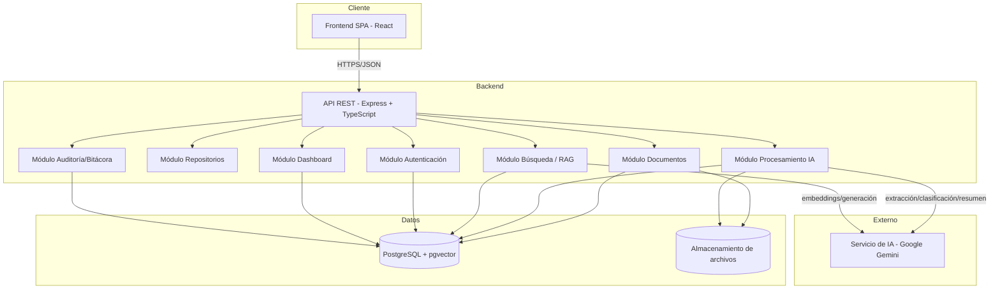
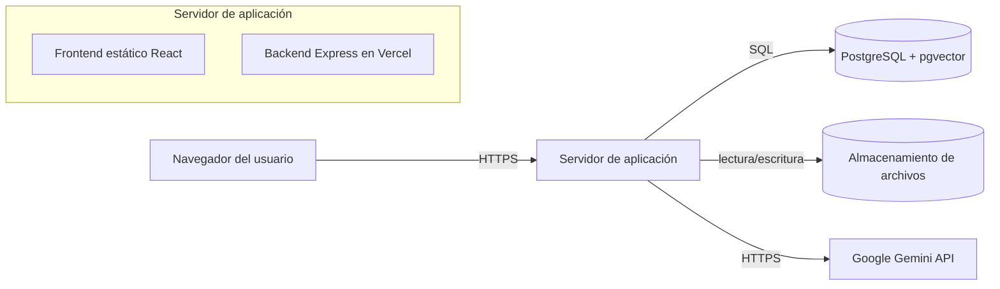

# DISEÑO 01 — Arquitectura General de la Solución
## Sistema Inteligente de Gestión y Análisis Documental (SIGAD)

*Este documento traduce los requisitos de Análisis 02 y los casos de uso de Análisis 04 en una arquitectura concreta. La implementación vigente verificada el 2026-09-10 es la referencia operativa; las descripciones históricas de FastAPI, OpenAI y almacenamiento local quedan reemplazadas por Node.js/Express, Gemini y Google Drive.*

## 1. Resumen del stack seleccionado

| Capa | Tecnología elegida |
|---|---|
| Frontend | React + TypeScript (SPA) |
| Backend / API | Node.js + Express + TypeScript, compatible con Vercel Serverless |
| Base de datos relacional + vectorial | PostgreSQL con extensión `pgvector` |
| Almacenamiento de archivos | Google Drive API v3 con subida resumible directa desde el cliente |
| Servicio de IA | Google Gemini mediante `@google/genai` |
| Autenticación | Token de sesión firmado HMAC-SHA256 + RBAC |

## 2. Vista lógica — arquitectura en capas

### 2.1 Descripción de capas

- **Frontend (React SPA):** interfaz de usuario para login, gestión de repositorios/documentos, búsqueda, chat documental y dashboard. Consume la API mediante peticiones HTTPS con el token de sesión Bearer en cabecera.
- **Backend (Express + TypeScript):** expone la API REST (ver Diseño 04) y organiza la lógica en módulos independientes, con entrada compatible con Vercel Serverless.
- **Datos:** PostgreSQL almacena entidades relacionales (usuarios, repositorios, documentos, categorías) **y**, mediante `pgvector`, los embeddings de los fragmentos de texto — evita operar dos motores de base de datos distintos (justificado en Diseño 07).
- **Almacenamiento de archivos:** los archivos originales (PDF/DOCX/TXT) se guardan en disco, organizados por repositorio/documento, referenciados desde la base de datos por ruta.
- **Servicio de IA (externo):** se invoca únicamente desde el Módulo de Procesamiento y el Módulo de Búsqueda/RAG; el resto del sistema no depende directamente de él, lo que aísla el riesgo R-01 (Análisis 05).

## 3. Vista de componentes (backend)

| Componente | Responsabilidad | RF que implementa |
|---|---|---|
| Módulo Autenticación | Login, emisión/validación de sesión HMAC-SHA256, control de rol | RF-01, RF-02 |
| Módulo Repositorios | CRUD de repositorios | RF-03, RF-04 |
| Módulo Documentos | Carga, listado, descarga, eliminación de archivos | RF-05, RF-06, RF-07, RF-08 |
| Módulo Procesamiento IA | Extracción de texto, chunking, embeddings, clasificación, resumen, extracción estructurada | RF-09, RF-10, RF-11, RF-12 |
| Módulo Búsqueda / RAG | Búsqueda semántica y consulta en lenguaje natural | RF-13, RF-14 |
| Módulo Dashboard | Cálculo de indicadores agregados | RF-15 |
| Módulo Auditoría/Bitácora | Registro de errores y eventos por documento | RF-16, RF-17 |

Cada componente corresponde 1 a 1 con un caso de uso o grupo de casos de uso de Análisis 04 (ver Diseño 02, Diagrama de Componentes, para la vista gráfica detallada).

## 4. Vista de despliegue (resumen)

Ampliado con nodos, puertos y variables de entorno en Diseño 02 (Diagrama de Despliegue) y en Implementación.

## 5. Decisiones arquitectónicas clave (resumen — detalle en Diseño 07)

| Decisión | Alternativa considerada | Elegida | Motivo breve |
|---|---|---|---|
| Motor de datos + vectores | Base de datos vectorial dedicada (ej. ChromaDB, Pinecone) | PostgreSQL + pgvector | Un solo motor a administrar; suficiente para el volumen académico (mínimo 30 documentos). |
| Backend | Node.js/Express vs Python/FastAPI | Node.js/Express + TypeScript | Comparte lenguaje con frontend y se despliega directamente como Vercel Serverless Function. |
| Almacenamiento de archivos | Sistema local vs Google Drive | Google Drive API v3 | Persistencia externa y subida directa desde el cliente; evita transportar binarios por la función serverless. |
| Proveedor de IA | Modelo local open-source vs Google Gemini | Google Gemini | Integración oficial mediante `@google/genai`; cubre generación y embeddings con dependencia externa controlada por variables de entorno. |

---
*Continúa en Diseño 02 (Diagramas UML detallados: casos de uso, componentes, despliegue, secuencia).*
