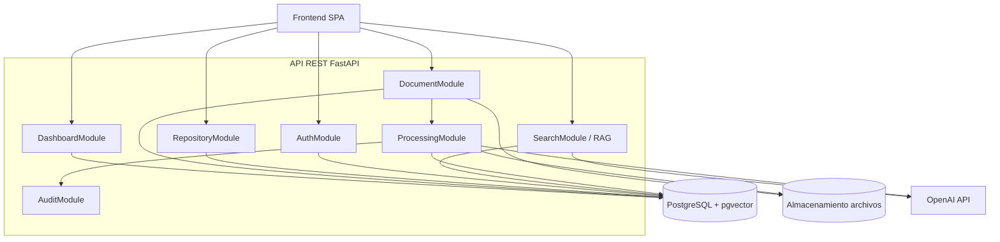
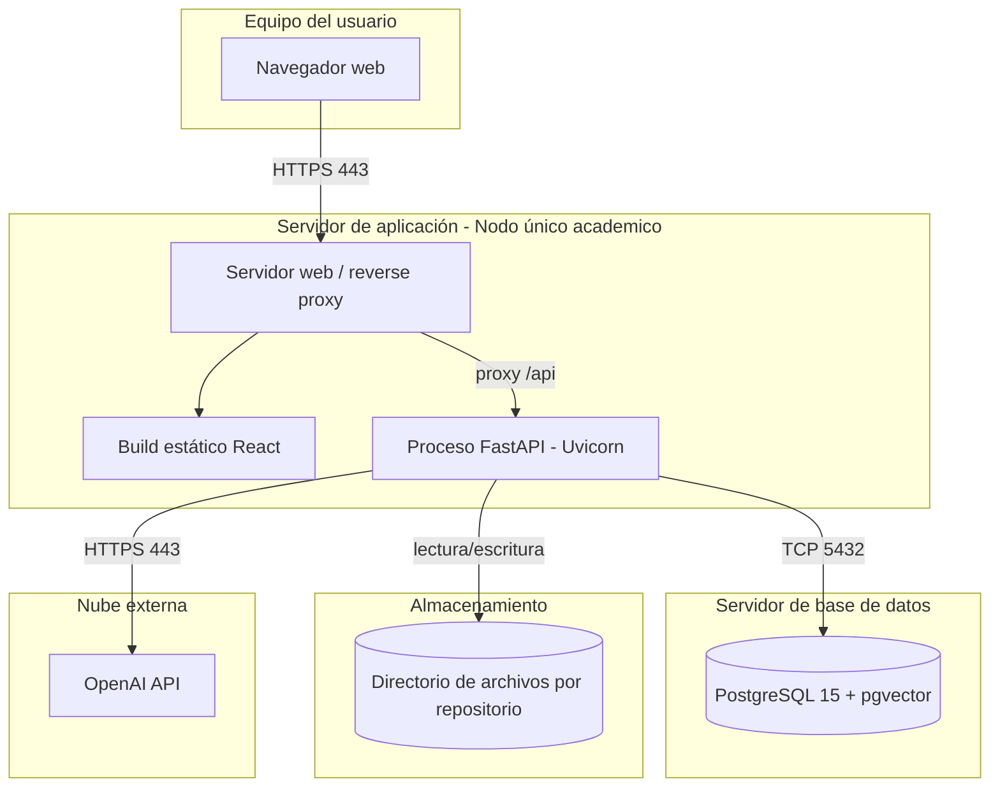
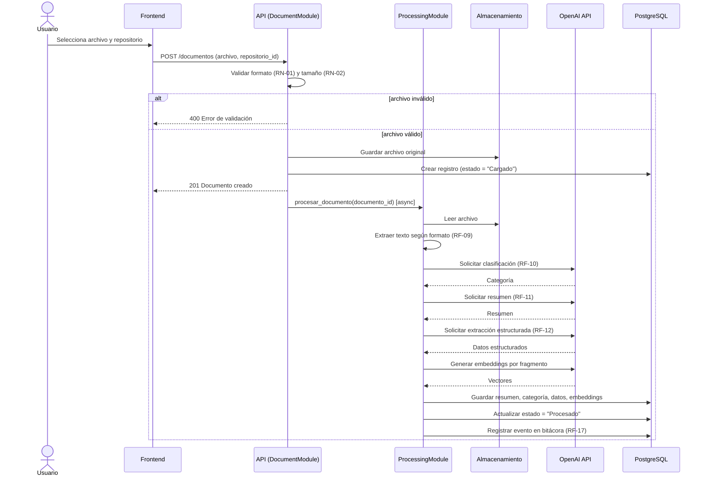
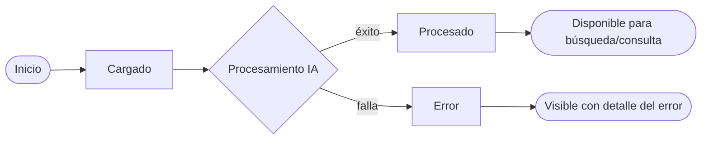

# DISEÑO 02 — Diagramas UML: Componentes, Despliegue y Secuencia
## Sistema Inteligente de Gestión y Análisis Documental (SIGAD)

*El Diagrama de Casos de Uso ya se presentó en Análisis 04 (sección 1) para mantenerlo junto a sus especificaciones; no se repite aquí. Este documento cubre Componentes, Despliegue y Secuencias de los flujos críticos.*

## 1. Diagrama de componentes

**Interfaces entre componentes (contratos internos):**
- `DocumentModule → ProcessingModule`: `procesar_documento(documento_id)` — invocado automáticamente tras una carga exitosa (CU-04 → CU-05).
- `ProcessingModule → AuditModule`: `registrar_evento(documento_id, tipo_evento, detalle)`.
- `SearchModule → ProcessingModule` (dato compartido, no llamada directa): reutiliza los embeddings ya generados por `ProcessingModule` y almacenados en `DB`.

## 2. Diagrama de despliegue

**Notas de despliegue** (se detallan en el documento de Implementación):
- Backend y Frontend pueden desplegarse en un único nodo para el alcance académico (contenedor o servidor único).
- Las credenciales de PostgreSQL y la API key de OpenAI se inyectan por variables de entorno (`.env`), nunca hardcodeadas (RNF-02).

## 3. Diagramas de secuencia — flujos principales

### 3.1 Secuencia: Carga y procesamiento de documento (CU-04 + CU-05)

**Manejo de error (RN-07):** si cualquier paso dentro de `PROC` falla, se captura la excepción, se guarda `estado = "Error"` con el detalle en la bitácora (RF-16), y el flujo termina sin propagar el fallo al resto del sistema.

### 3.2 Secuencia: Consulta en lenguaje natural (CU-09, patrón RAG)

### 3.3 Diagrama de actividad — ciclo de vida de un documento

---
*Estos diagramas deben ser consistentes entre sí: los componentes usados en 3.1 y 3.2 son exactamente los definidos en la sección 1; los estados usados en 3.3 son los definidos en Análisis 02, sección 4.*
