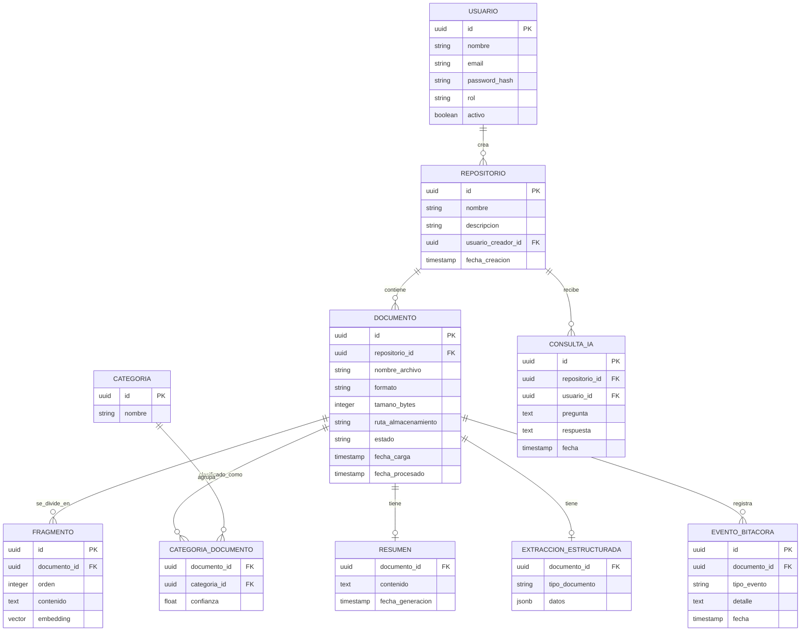

# DISEÑO 03 — Modelo de Datos y Diccionario de Datos
## Sistema Inteligente de Gestión y Análisis Documental (SIGAD)

*Modelo derivado directamente de las entidades identificadas en Análisis 02–04. Motor: PostgreSQL con extensión `pgvector` (justificación en Diseño 07).*

## 1. Modelo Entidad-Relación (conceptual)

## 2. Diccionario de datos técnico

### Tabla `usuario`
| Campo | Tipo | Restricciones | Descripción |
|---|---|---|---|
| id | UUID | PK | Identificador único |
| nombre | VARCHAR(120) | NOT NULL | Nombre completo |
| email | VARCHAR(160) | NOT NULL, UNIQUE | Usado como login |
| password_hash | VARCHAR(255) | NOT NULL | Hash bcrypt (RNF-02) |
| rol | VARCHAR(30) | NOT NULL, CHECK IN ('administrador','usuario') | Rol del sistema (RF-02) |
| activo | BOOLEAN | NOT NULL, DEFAULT true | Permite desactivar cuentas (CU-10) |

### Tabla `repositorio`
| Campo | Tipo | Restricciones | Descripción |
|---|---|---|---|
| id | UUID | PK | Identificador único |
| nombre | VARCHAR(150) | NOT NULL | Nombre del repositorio (RF-03) |
| descripcion | TEXT | NULL | Descripción opcional |
| usuario_creador_id | UUID | FK → usuario.id, NOT NULL | Creador del repositorio |
| fecha_creacion | TIMESTAMP | NOT NULL, DEFAULT now() | Auditoría |

### Tabla `documento`
| Campo | Tipo | Restricciones | Descripción |
|---|---|---|---|
| id | UUID | PK | Identificador único |
| repositorio_id | UUID | FK → repositorio.id, NOT NULL | Regla RN-03: sin documentos huérfanos |
| nombre_archivo | VARCHAR(255) | NOT NULL | Nombre original del archivo |
| formato | VARCHAR(10) | NOT NULL, CHECK IN ('pdf','docx','txt') | Regla RN-01 |
| tamano_bytes | INTEGER | NOT NULL, CHECK ≤ 20971520 | Regla RN-02 (20 MB) |
| ruta_almacenamiento | VARCHAR(500) | NOT NULL | Ruta física/relativa del archivo original |
| estado | VARCHAR(20) | NOT NULL, CHECK IN ('cargado','procesando','procesado','error') | Ciclo de vida (Análisis 02, §4) |
| fecha_carga | TIMESTAMP | NOT NULL, DEFAULT now() | RF-05 |
| fecha_procesado | TIMESTAMP | NULL | Se llena al finalizar CU-05 |

### Tabla `fragmento`
| Campo | Tipo | Restricciones | Descripción |
|---|---|---|---|
| id | UUID | PK | Identificador único |
| documento_id | UUID | FK → documento.id, NOT NULL | Documento de origen |
| orden | INTEGER | NOT NULL | Posición del fragmento dentro del documento |
| contenido | TEXT | NOT NULL | Texto del fragmento (chunk) |
| embedding | VECTOR(1536) | NOT NULL | Vector generado por el modelo de embeddings (RF-13, RF-14) |

### Tabla `categoria`
| Campo | Tipo | Restricciones | Descripción |
|---|---|---|---|
| id | UUID | PK | Identificador único |
| nombre | VARCHAR(80) | NOT NULL, UNIQUE | Ej.: "Contrato", "Factura", "Informe" (mínimo 3, RF-10) |

### Tabla `categoria_documento` (relación N:M)
| Campo | Tipo | Restricciones | Descripción |
|---|---|---|---|
| documento_id | UUID | FK → documento.id | — |
| categoria_id | UUID | FK → categoria.id | — |
| confianza | FLOAT | NULL | Confianza de la clasificación IA (0–1) |

### Tabla `resumen`
| Campo | Tipo | Restricciones | Descripción |
|---|---|---|---|
| documento_id | UUID | PK, FK → documento.id | Relación 1:1 |
| contenido | TEXT | NOT NULL | Resumen generado (RF-11) |
| fecha_generacion | TIMESTAMP | NOT NULL | Auditoría |

### Tabla `extraccion_estructurada`
| Campo | Tipo | Restricciones | Descripción |
|---|---|---|---|
| documento_id | UUID | PK, FK → documento.id | Relación 1:1 |
| tipo_documento | VARCHAR(50) | NOT NULL | Uno de los tres tipos soportados (ver Diseño 06) |
| datos | JSONB | NOT NULL | Campos estructurados extraídos, específicos por tipo (RF-12) |

### Tabla `evento_bitacora`
| Campo | Tipo | Restricciones | Descripción |
|---|---|---|---|
| id | UUID | PK | Identificador único |
| documento_id | UUID | FK → documento.id, NOT NULL | Documento asociado |
| tipo_evento | VARCHAR(40) | NOT NULL | 'cargado','procesado','error','descargado','eliminado' |
| detalle | TEXT | NULL | Mensaje o causa del error (RF-16) |
| fecha | TIMESTAMP | NOT NULL, DEFAULT now() | RF-17 |

### Tabla `consulta_ia`
| Campo | Tipo | Restricciones | Descripción |
|---|---|---|---|
| id | UUID | PK | Identificador único |
| repositorio_id | UUID | FK → repositorio.id, NOT NULL | Repositorio consultado |
| usuario_id | UUID | FK → usuario.id, NOT NULL | Quién preguntó |
| pregunta | TEXT | NOT NULL | Pregunta en lenguaje natural (RF-14) |
| respuesta | TEXT | NOT NULL | Respuesta generada |
| fecha | TIMESTAMP | NOT NULL, DEFAULT now() | Auditoría |

## 3. Índices clave

- `fragmento(embedding)`: índice `ivfflat` (pgvector) para búsqueda de similitud eficiente (RF-13, RF-14).
- `documento(repositorio_id, estado)`: índice compuesto para listados filtrados y dashboard (RF-06, RF-15).
- `evento_bitacora(documento_id, fecha)`: índice para consultas de bitácora ordenadas (RF-17).

---
*Este modelo soporta directamente los endpoints definidos en Diseño 04 (Diseño de API) y los datos mostrados en Diseño 05 (Interfaces).*
