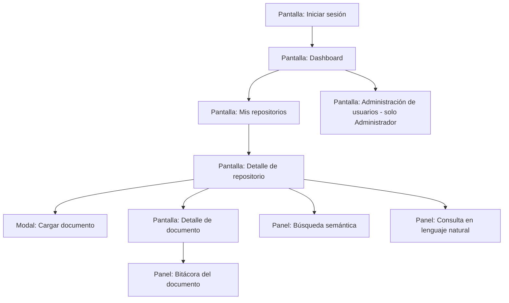

# DISEÑO 05 — Diseño de Interfaces y Prototipos
## Sistema Inteligente de Gestión y Análisis Documental (SIGAD)

*Wireframes descriptivos por pantalla, mapa de navegación y guía de estilo base. Cada pantalla referencia el CU y RF que soporta, cumpliendo RNF-03 (máx. 3 clics para funciones principales).*

## 1. Mapa de navegación

## 2. Pantallas

### 2.1 Iniciar sesión (CU-01)
- Campos: email, contraseña.
- Botón "Ingresar"; mensaje de error genérico si falla.
- Sin menú lateral (pantalla previa a autenticación).

### 2.2 Dashboard (CU-11)
- Tarjetas de indicadores: total de documentos, documentos por estado (Cargado/Procesando/Procesado/Error), gráfico de distribución por categoría.
- Acceso directo a "Mis repositorios" y, si el rol es Administrador, a "Administración de usuarios".

### 2.3 Mis repositorios (CU-02, CU-03)
- Listado en tarjetas o tabla: nombre, cantidad de documentos, fecha de creación.
- Botón "Crear repositorio" (abre formulario simple: nombre, descripción).
- Acciones por repositorio: abrir, editar/eliminar (solo visibles para Administrador).

### 2.4 Detalle de repositorio (CU-04, CU-06, CU-07, CU-08, CU-09)
- Tabla de documentos: nombre, formato, estado (con color: cargado=gris, procesando=amarillo, procesado=verde, error=rojo), categoría, fecha.
- Botón "Cargar documento" (abre modal de carga con selector de archivo y validación de formato/tamaño en el propio formulario, antes de enviar).
- Barra de búsqueda semántica en la parte superior (RF-13).
- Panel de chat/consulta en lenguaje natural, accesible como pestaña o panel lateral (RF-14), con historial de preguntas/respuestas de la sesión y referencia a documentos fuente.
- Acciones por fila: ver detalle, descargar, eliminar.

### 2.5 Modal: Cargar documento (CU-04)
- Selector de archivo (drag & drop o click), restringido a `.pdf`, `.docx`, `.txt`.
- Indicador de progreso de carga y, tras cargar, indicador de "procesando con IA…" no bloqueante (el usuario puede seguir navegando).

### 2.6 Detalle de documento (CU-06, CU-10)
- Encabezado: nombre, formato, estado, categoría(s) con nivel de confianza.
- Sección "Resumen automático" (RF-11).
- Sección "Información extraída" — tabla clave/valor según el tipo de documento (RF-12).
- Botón "Descargar original" (RF-07).
- Botón "Eliminar documento" (RF-08), con confirmación.
- Pestaña/panel "Bitácora" con el historial cronológico de eventos (RF-17).

### 2.7 Administración de usuarios (CU-10, solo Administrador)
- Tabla de usuarios: nombre, email, rol, estado (activo/inactivo).
- Formulario para crear usuario; acción para activar/desactivar.

## 3. Guía de estilo base

| Elemento | Definición |
|---|---|
| Paleta | Neutros (grises) como base; un color de acento para acciones primarias; verde/amarillo/rojo/gris reservados exclusivamente para estados de documento (evita ambigüedad visual). |
| Tipografía | Una familia sans-serif del sistema (ej. Inter/Segoe UI) para máxima legibilidad y sin dependencias de licencias. |
| Componentes reutilizables | Tarjeta de indicador (dashboard), fila de tabla de documento, badge de estado, badge de categoría, modal de confirmación (usado en eliminar documento/repositorio). |
| Responsividad | Diseño adaptable: tabla de documentos colapsa a tarjetas en pantallas angostas (cumple RNF-03 en dispositivos móviles). |

---
*Estos wireframes describen el contrato visual mínimo; el detalle pixel-perfect se resuelve en Desarrollo usando estos lineamientos como base.*
