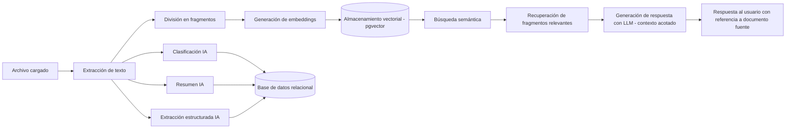

# DISEÑO 06 — Diseño de la Integración con IA y Flujo de Procesamiento Documental
## Sistema Inteligente de Gestión y Análisis Documental (SIGAD)

*Este documento responde directamente al requisito central del proyecto: demostrar el flujo real archivo → extracción → procesamiento IA → análisis → almacenamiento → búsqueda/consulta → respuesta (no un CRUD con un botón "IA").*

## 1. Técnica seleccionada: RAG (Retrieval-Augmented Generation)

**Alternativas evaluadas:**

| Alternativa | Descripción | Decisión |
|---|---|---|
| Fine-tuning de un modelo propio | Reentrenar un modelo con los documentos de la empresa | Descartada: alto costo, tiempo y datos de entrenamiento fuera del alcance académico. |
| Búsqueda por palabras clave (full-text search clásico) | Índices invertidos tipo `tsvector` | Descartada como único mecanismo: no resuelve búsqueda semántica ni preguntas en lenguaje natural (RF-13, RF-14 lo exigen explícitamente). |
| **RAG con embeddings + base vectorial** | Recuperar fragmentos relevantes por similitud semántica y usarlos como contexto para que un LLM genere la respuesta | **Seleccionada.** Es el estándar actual para "preguntar sobre documentos propios" sin reentrenar modelos, y permite trazabilidad (la respuesta cita su fuente), cumpliendo RN-08. |

## 2. Componentes técnicos del flujo IA

| Etapa | Técnica/herramienta | Justificación |
|---|---|---|
| Extracción de texto | `pypdf`/`pdfplumber` (PDF), `python-docx` (DOCX), lectura directa (TXT) | Librerías estándar, sin costo, suficientes para documentos con texto extraíble (ver limitación en sección 5). |
| División en fragmentos (chunking) | Fragmentos de ~500–800 tokens con solapamiento de ~100 tokens | Balance entre contexto suficiente para el LLM y precisión de la búsqueda semántica. |
| Embeddings | `text-embedding-3-small` (OpenAI) | Buen desempeño en español, costo bajo, dimensión manejable (1536) para `pgvector`. |
| Almacenamiento vectorial | `pgvector` sobre PostgreSQL (tabla `fragmento`, Diseño 03) | Un solo motor de datos (ver Diseño 07). |
| Clasificación | Prompt estructurado a `gpt-4o-mini` con las categorías predefinidas | Modelo económico, suficiente para clasificación de texto con categorías cerradas. |
| Resumen | Prompt de resumen a `gpt-4o-mini` sobre el texto completo extraído | Mismo modelo que clasificación, evita costos de dos proveedores distintos. |
| Extracción estructurada | Prompt con *function calling* / salida JSON forzada a `gpt-4o-mini`, esquema específico por tipo de documento | Garantiza una salida parseable y validable antes de guardarla en `extraccion_estructurada.datos`. |
| Generación de respuesta (RAG) | `gpt-4o-mini` con los fragmentos recuperados como contexto exclusivo | Cumple RN-08: la respuesta no debe basarse en conocimiento externo del modelo. |

## 3. Tres tipos de documento con extracción estructurada (cumplimiento de RF-12)

Para evitar ambigüedad en Desarrollo, se fijan los tres tipos mínimos y sus campos:

| Tipo de documento | Campos extraídos |
|---|---|
| Contrato | partes involucradas, fecha de inicio, plazo/vigencia, objeto del contrato |
| Factura | número de factura, fecha de emisión, valor total, emisor/receptor |
| Informe / reporte | título, autor(es) (si consta), fecha, tema principal, conclusiones clave |

Estas tres categorías coinciden con las tres categorías mínimas de clasificación exigidas (RF-10), evitando inconsistencia entre "categoría" y "tipo de documento".

## 4. Flujo completo (trazabilidad archivo → respuesta)

Este diagrama es la referencia obligatoria para verificar, en la sustentación, que el flujo real de IA está implementado y no simulado.

## 5. Limitaciones reconocidas y su tratamiento

- **PDFs escaneados (sin texto extraíble):** fuera del alcance mínimo garantizado; se documenta como mejora futura mediante OCR (`pytesseract`) si el cronograma lo permite (ver R-02 en Análisis 05). El sistema debe detectar este caso y marcar el documento como "Error" con detalle explicativo, no fallar silenciosamente.
- **Costo/límite de la API de IA:** mitigado seleccionando modelos económicos y documentando manejo de reintentos (Diseño 07, sección de resiliencia).
- **Alucinación del modelo:** mitigada por RN-08 (respuesta restringida al contexto recuperado) y por mostrar siempre la(s) fuente(s) documental(es).

---
*Este documento es insumo directo para el Manual Técnico de la fase Desarrollo (implementación del `ProcessingModule` y `SearchModule`).*
