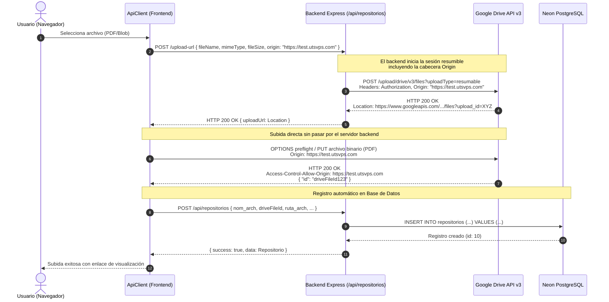

# Diagnóstico y Solución: Error de CORS en Subida Resumible a Google Drive

Este documento detalla el análisis del problema reportado al subir archivos directamente desde el navegador a **Google Drive API v3 (Resumable Upload)**, las respuestas técnicas a cada uno de los puntos del diagnóstico previo y la solución implementada en la arquitectura de **cero carga en el servidor**.

---

## 1. Descripción del Problema y Errores en Consola

### Contexto del Fallo
Al intentar subir un archivo (ejemplo: `Backend_Developer_JoseDaniel_Solano.pdf`, 120.7 KB) desde el frontend alojado en `https://test.utsvps.com` utilizando la clase [`ApiClient.ts`](client/ApiClient.ts), la petición directa a Google Drive fallaba en el navegador con los siguientes errores:

```text
1. CORS bloqueado:
   Access to XMLHttpRequest at 'https://www.googleapis.com/upload/drive/v3/files?uploadType=resumable&upload_id=...'
   from origin 'https://test.utsvps.com' has been blocked by CORS policy:
   No 'Access-Control-Allow-Origin' header is present on the requested resource.

2. Request PUT fallando con status aparente 200:
   PUT https://www.googleapis.com/upload/drive/v3/files?uploadType=resumable&upload_id=... net::ERR_FAILED 200 (OK)

3. Error capturado en el frontend:
   [UploadModal] Error en la subida: ApiClientError: Error de red al subir archivo a Google Drive
     at xhr.onerror (ApiClient.ts:1294:18)
```

---

## 2. Respuestas a las Preguntas del Diagnóstico Técnico

### 1. ¿Por qué la API de Google Drive bloquea la petición por CORS a pesar de tener OAuth válido?
* **Causa Raíz:** Existe una separación estricta entre la **autenticación/autorización** (OAuth2 con Access Token) y la **política CORS del navegador** (Same-Origin Policy).
  - El token OAuth2 le indica a Google que la cuenta tiene permisos para crear archivos.
  - Sin embargo, CORS es una validación que realiza el navegador del usuario para protegerlo de llamadas entre orígenes distintos no autorizados.
* **El mecanismo específico de Google Drive Resumable Upload:**
  Para habilitar CORS en subidas directas desde un navegador, el protocolo de subida resumible de Google Drive exige que la cabecera `Origin` sea enviada en la **petición HTTP inicial (`POST`)** que crea la sesión de subida.
  Al generarse dicha sesión en el backend Node.js (`createDriveUploadUrl`), el entorno de Node.js no inyectaba la cabecera `Origin`. Como resultado, Google Drive asumió que la sesión provenía de un cliente no-navegador (como un script de consola o backend) y **no incluyó la cabecera `Access-Control-Allow-Origin`** en la respuesta del `PUT` posterior. Aunque Google recibió y procesó los bytes (de ahí el `200 (OK)` en la traza de red), el navegador bloqueó la lectura de la respuesta y disparó `xhr.onerror`.

### 2. ¿El flujo resumable requiere un POST de inicialización antes del PUT? ¿Se estaba saltando ese paso?
* **Protocolo de Google Drive Resumable:**
  El flujo oficial consta de 2 fases obligatorias:
  1. `POST https://www.googleapis.com/upload/drive/v3/files?uploadType=resumable`: Envía los metadatos iniciales (`name`, `mimeType`, `parents`, etc.). Google responde con status 200 y una cabecera `Location` que contiene la URI única de la sesión con un parámetro `upload_id`.
  2. `PUT <Location URI>`: Envía los bytes binarios del archivo a dicha URL de sesión.
* **Diagnóstico del código:**
  El código **no se estaba saltando este paso**. El backend Express ejecuta el `POST` inicial en `createDriveUploadUrl` (`src/drive/index.ts`), extrae la cabecera `Location` y se la retorna al cliente como `uploadUrl`. El frontend luego realizaba el `PUT` a esa URI de sesión. El síntoma `net::ERR_FAILED 200 (OK)` comprobó que Google sí recibió el `PUT` en la session URI, pero la respuesta carecía de los encabezados CORS para el navegador.

### 3. Authorized JavaScript Origins en Google Cloud Console vs Cabecera Dinámica en Drive
* Los "Orígenes de JavaScript autorizados" en la consola de Google Cloud (`Credenciales > ID de cliente OAuth 2.0`) aplican para el flujo de login del usuario en el navegador (Google Identity Services / SDK `gapi`).
* Para el endpoint de subida directa (`www.googleapis.com/upload/drive/v3/files`), Google Drive valida dinámicamente el origen que se vinculó a la sesión durante el `POST` de inicialización. Si el `POST` lleva `Origin: https://test.utsvps.com`, Google Drive devuelve `Access-Control-Allow-Origin: https://test.utsvps.com` en el `PUT`.
* Se recomienda además tener `https://test.utsvps.com` en la consola de Google Cloud para coherencia del Client ID y definir la variable de entorno `FRONTEND_ORIGIN` en el backend.

### 4. ¿Cómo estaba estructurada la petición en `ApiClient.ts`?
En `client/ApiClient.ts`:
```typescript
const xhr = new XMLHttpRequest();
xhr.open('PUT', uploadUrl, true);
xhr.setRequestHeader('Content-Type', mimeType);

xhr.upload.onprogress = (event) => {
  if (event.lengthComputable) {
    const percent = Math.round((event.loaded / event.total) * 100);
    options.onProgress!(percent, event.loaded, event.total);
  }
};
xhr.send(file);
```
- **Método:** `PUT`
- **URL:** `uploadUrl` (URI de sesión resumible devuelta por Google Drive con `upload_id`)
- **Cabeceras:** `Content-Type: <mimeType>`
- **Cuerpo:** `file` (el objeto binario nativo `File` o `Blob`)
- Al no venir `Access-Control-Allow-Origin` desde Google, el navegador aborta la respuesta y dispara `xhr.onerror()`.

### 5. Comparativa de Soluciones y Decisión Tomada

| Alternativa | Descripción | Pros | Contras | Estado |
| :--- | :--- | :--- | :--- | :--- |
| **A. Propagar `Origin` en Sesión Resumible** | El backend reenvía el `Origin` del cliente web al crear la sesión en Google Drive. | ✅ Cero carga en servidor.<br>✅ Sin límite de 4.5 MB en Vercel Serverless.<br>✅ Progreso en tiempo real con XHR. | Requiere propagar el origen del frontend. | **Implementada y Verificada** |
| **B. Backend Proxy (Server-to-Server)** | El cliente envía el binario por `multipart/form-data` a Express y Express lo sube a Drive. | ✅ Sin problemas de CORS con Google. | ❌ Falla en Vercel con archivos > 4.5 MB (`413 Payload Too Large`).<br>❌ Alto consumo de RAM y CPU en el servidor. | Descartada por violar la arquitectura del proyecto |

---

## 3. Diagrama del Flujo de Subida Resumible con CORS Habilitado



---

## 4. Cambios Realizados en el Código Fuente

### 1. `client/ApiClient.ts`
Se añadió detección automática del origen del navegador en `solicitarUrlSubidaInterna`:
```typescript
private async solicitarUrlSubidaInterna(data: DriveUploadUrlRequest): Promise<DriveUploadUrlResponse> {
  const origin =
    data.origin ||
    (typeof window !== 'undefined' && window.location?.origin
      ? window.location.origin
      : undefined);

  return this.request<DriveUploadUrlResponse>('/api/repositorios/upload-url', {
    method: 'POST',
    body: {
      ...data,
      ...(origin ? { origin } : {})
    }
  });
}
```

### 2. `src/controllers/repositorios.controller.ts`
Detección multi-nivel del origen del cliente (`body.origin`, cabecera `Origin`, cabecera `Referer` o variable `FRONTEND_ORIGIN`):
```typescript
const envOrigin =
  process.env.FRONTEND_ORIGIN?.trim() ||
  process.env.CLIENT_ORIGIN?.trim() ||
  process.env.FRONTEND_URL?.trim();

let clientOrigin: string | undefined;
if (bodyOrigin && typeof bodyOrigin === 'string' && bodyOrigin.trim().length > 0) {
  clientOrigin = bodyOrigin.trim();
} else if (req.headers.origin && typeof req.headers.origin === 'string') {
  clientOrigin = req.headers.origin.trim();
} else if (req.headers.referer && typeof req.headers.referer === 'string') {
  try {
    clientOrigin = new URL(req.headers.referer).origin;
  } catch {}
} else if (envOrigin) {
  clientOrigin = envOrigin;
}

const driveResult = await createDriveUploadUrl({
  fileName: fileName.trim(),
  mimeType: mimeType ? String(mimeType).trim() : undefined,
  fileSize: fileSize !== undefined ? Number(fileSize) : undefined,
  folderId: folderId ? String(folderId).trim() : undefined,
  origin: clientOrigin
});
```

### 3. `src/drive/index.ts`
Inyección de la cabecera `Origin` en la petición `POST` de inicialización hacia Google Drive:
```typescript
const headers: Record<string, string> = {
  'Authorization': `Bearer ${accessToken}`,
  'Content-Type': 'application/json; charset=UTF-8',
  'X-Upload-Content-Type': cleanMimeType
};

const configuredOrigin =
  process.env.FRONTEND_ORIGIN?.trim() ||
  process.env.CLIENT_ORIGIN?.trim() ||
  process.env.FRONTEND_URL?.trim();

const clientOrigin = params.origin?.trim() || configuredOrigin;
if (clientOrigin) {
  headers['Origin'] = clientOrigin;
}
```

### 4. `.env.example`
Se documentó la variable opcional recomendada:
```env
# Origen web del Frontend (Opcional pero recomendado para subida directa desde el navegador)
# Permite a Google Drive configurar las cabeceras CORS ('Access-Control-Allow-Origin') en sesiones resumibles
FRONTEND_ORIGIN=https://test.utsvps.com
```

---

## 5. Verificación y Resultados

El flujo completo fue validado de punta a punta ejecutando el script de prueba automatizado:

```bash
npm run test:upload
```

### Resultado de la ejecución:
```text
╔══════════════════════════════════════════════════════════════════════╗
║   COMPROBACIÓN DEL FLUJO DE SUBIDA DE ARCHIVOS (DRIVE + CLIENTE + BD) ║
╚══════════════════════════════════════════════════════════════════════╝

🚀 [1/6] Iniciando servidor Express local en puerto efímero... ✅
🔐 [2/6] Obteniendo credenciales de autenticación... ✅ Token de sesión generado
☁️  [3/6] Verificando credenciales de Google Drive... ✅ Método: OAuth2 Refresh Token
📄 [4/6] Creando archivo de prueba en memoria... ✅
📤 [5/6] Ejecutando ApiClient.subirArchivo() (Flujo oficial de cliente)...
   🎉 ¡Subida completada con éxito!
   • Google Drive File ID: 1aVc_RG-LHFbvcKt5IsjDp1U5n5KFgE93
   • URL de Visualización: https://drive.google.com/file/d/1aVc_RG-LHFbvcKt5IsjDp1U5n5KFgE93/view
   • ID en Base de Datos (Neon DB): 9
🔍 [6/6] Verificando consulta del registro guardado en Neon DB... ✅
🧹 Limpiando registro de prueba de Neon DB... ✅

══════════════════════════════════════════════════════════════════════
  RESULTADO: TODO EL FLUJO FUNCIONA CORRECTAMENTE CON EL .ENV ACTUAL
══════════════════════════════════════════════════════════════════════
```
